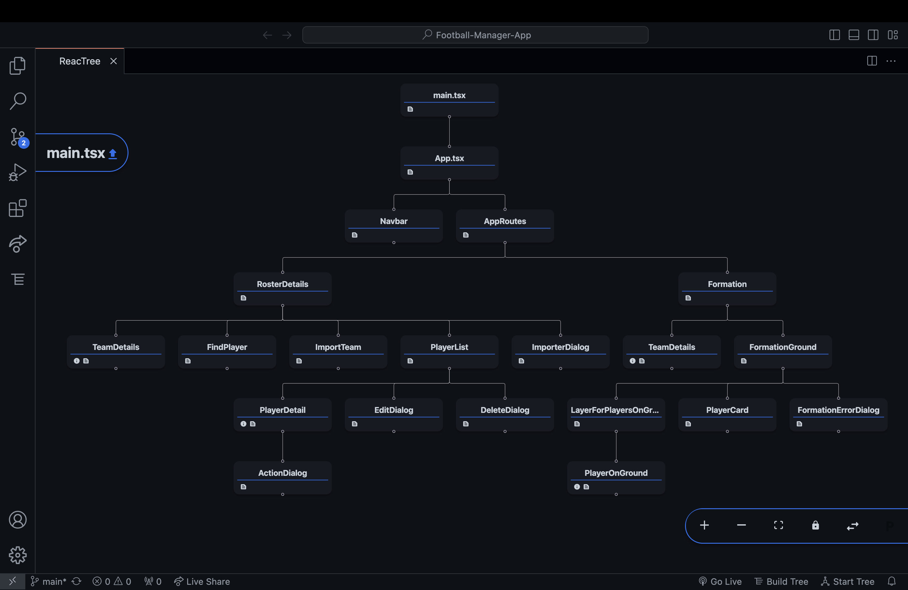

# Football-Manager-App
The Football Manager app is a dynamic web application crafted with Vite, React, Tailwind CSS, and Redux. It empowers users to manage teams, add, update, or delete players, and visualize team formations.

## Table of Contents

1. [Introduction](#introduction)
2. [Technologies Used](#technologies-used)
3. [Project Overview](#project-overview)
    - [Description](#description)
    - [Live Link](#live-link)
    - [Demo](#demo)
4. [Features](#features)
    - [Roster Details](#roster-details)
        - [Editable Team Name](#editable-team-name)
        - [Search Field](#search-field)
        - [Roster Importer](#roster-importer)
        - [Roster Table](#roster-table)
    - [Formation Overview](#formation-overview)
        - [Formation Preview](#formation-preview)
        - [Player Details](#player-details)
5. [Directory Structure](#directory-structure)
    - [Project Directory Structure](#project-directory-structure)
    - [Components Structure](#components-structure)
        - [Components Description](#components-description)
1. [Getting Started](#getting-started)
   - [Installation](#installation)
1. [Usage](#usage)
1. [State Management](#state-management-overview)
1. [Deployment](#deployment)


## Introduction
Welcome to the Football Manager application's README! This repository hosts a comprehensive web application developed using Vite, React, Tailwind CSS, and Redux. The project revolves around managing football teams, offering functionalities such as team and player management, dynamic roster import, formation visualization, and player details display. The README aims to provide a structured guide to navigate through the project's features, technologies used, installation guidelines, and more. Dive in to explore the world of team management and player analytics with this Football Manager application!

## Technologies Used
1.  **Vite**: *A next-generation frontend tooling that powers the project's build and development workflow, ensuring rapid development and optimized production builds.*

2.  **React**: *A JavaScript library for building user interfaces. React is the core framework used to create the application's components, manage UI rendering, and handle user interactions efficiently.*

3.  **Tailwind CSS**: *A utility-first CSS framework used to design the app's responsive and customizable user interface. Tailwind CSS streamlines the styling process with pre-defined utility classes.*

4.  **Redux**: *A predictable state container for JavaScript apps. Redux is employed for managing application state, handling complex data flow, and ensuring efficient state updates across the app.*

5. **Additional Libraries**:
    - **React-Redux**: *Specifically used for integrating Redux with React components.*

    - **Various Redux Toolkit Slices**: *Divided logical parts of state management into slices for maintainability and scalability.*

    - **Other Utility Libraries**: *PapaParse a powerful CSV parsing library in JavaScript used specifically for file handling within the application. PapaParse simplifies the process of reading, parsing, and handling CSV files, enabling seamless import and processing of roster data.*

## Project Overview
This comprehensive application serves as a robust solution for passionate football enthusiasts, offering an immersive experience in managing teams, handling player rosters, and visualizing formations.

- ### Description
    Immerse yourself in the world of team management with a suite of powerful features at your fingertips. Seamlessly add, update, or remove players while effortlessly importing roster data via CSV files, effortlessly managed and parsed using PapaParse. The application's state-of-the-art functionalities enable users to delve into detailed player information, swiftly filter and search for specific players based on name or position, and execute actions such as editing or deleting players with ease.

- ### Live Link
    Explore the Football Manager application by [clicking here](https://admirable-alpaca-050b7c.netlify.app).

- ### Demo
    

Click on the image above to watch a demo of the Football Manager App.


## Features
### Roster Details
#### Editable Team Name
- The application allows users to edit the team name, with the edit icon persistently visible until the name is changed once. Afterward, the icon appears only on hovering the name.

#### Search Field
- Users can filter players by name and/or position using a search bar.
- The search functionality handles keystrokes (Enter to execute search, ESC to cancel, and 'x' to clear criteria).
Clearing the search reveals all results.

#### Roster Importer
- Seamless roster importing from CSV files with error handling:
- Validates and ensures the file contains no empty values.
Accepts only .csv files.
- Provides a summary of player count and positions pre-import.
- Offers a 'Re-Import' option, clearing and refreshing the state upon subsequent imports.

#### Roster Table
- Displays player data fetched from the application state.
Handles empty states by presenting a message instead of an empty table.
- Includes player names, country flags, converted Height and Weight, and an actions menu for editing or deleting players.

### Formation Overview
#### Formation Preview
- Renders the 4-3-3 formation on the field, positioning players accordingly.
- Validates and displays starters in each position available in the roster:
    1. Goalkeeper (mandatory)
    2. Defenders (four required)
    3. Midfielders (three required)
    4. Forwards (three required)
- Handles conditions to display formation, showing respective messages if conditions are not met.

#### Player Details
- Allows users to view detailed player information.
- Displays player stats based on positions:
    1. Goalkeepers: Clean Sheets and Saves
    2. Other Positions: Goals and Assists
- Common stats for all positions include Appearances and Minutes Played.

## Directory Structure
### Project Directory Structure
```bash
Football-Manager-App/
├── README.md
├── index.html
├── package-lock.json
├── package.json
├── postcss.config.js
├── public
│   └── logo.svg
├── src
│   ├── App.css
│   ├── App.tsx
│   ├── app
│   │   └── store.ts
│   ├── assets
│   │   ├── Poppins-Regular.ttf
│   │   ├── chevron-down.svg
│   │   ├── close.svg
│   │   ├── logo.svg
│   │   ├── magnifying-glass.svg
│   │   ├── pen.svg
│   │   ├── selected-bars.svg
│   │   ├── selected-elipse.svg
│   │   ├── selected-user-lines.svg
│   │   ├── soccer-field.svg
│   │   ├── three-dots.svg
│   │   ├── trash-alt.svg
│   │   ├── triangle-exclamation.svg
│   │   ├── unselected-bars.svg
│   │   └── unselected-user-lines.svg
│   ├── components
│   │   ├── ActionDialog.tsx
│   │   ├── AppRoutes.tsx
│   │   ├── DeleteDialog.tsx
│   │   ├── EditDialog.tsx
│   │   ├── FindPlayer.tsx
│   │   ├── FormationErrorDialog.tsx
│   │   ├── FormationGround.tsx
│   │   ├── ImportTeam.tsx
│   │   ├── ImporterDialog.tsx
│   │   ├── LayerForPlayersOnGround.tsx
│   │   ├── Navbar.tsx
│   │   ├── PlayerCard.tsx
│   │   ├── PlayerDetail.tsx
│   │   ├── PlayerList.tsx
│   │   ├── PlayerOnGround.tsx
│   │   └── TeamDetails.tsx
│   ├── index.css
│   ├── main.tsx
│   ├── pages
│   │   ├── Formation.tsx
│   │   └── RosterDetails.tsx
│   ├── redux
│   │   ├── editPlayer
│   │   │   └── editPlayerSlice.ts
│   │   ├── fileImporter
│   │   │   └── fileImporterSlice.ts
│   │   ├── formationError
│   │   │   └── formationErrorSlice.ts
│   │   ├── formationGround
│   │   │   └── formationGroundSlice.ts
│   │   ├── navbar
│   │   │   └── navbarSlice.ts
│   │   ├── playerAction
│   │   │   └── playerActionSlice.ts
│   │   ├── playerDetails
│   │   │   └── playerDetailsSlice.ts
│   │   ├── searchPlayer
│   │   │   └── searchPlayerSlice.ts
│   │   └── teamName
│   │       └── teamNameSlice.ts
│   ├── utils
│   │   └── colors.ts
│   └── vite-env.d.ts
├── tailwind.config.js
├── tsconfig.json
├── tsconfig.node.json
└── vite.config.ts
```

### Components Structure



#### Components Description

- **ActionDialog.tsx**:
Manages actions/dialogs related to specific player actions (edit, delete, etc.).

- **AppRoutes.tsx**:
Defines the application's routes and their respective components.

- **DeleteDialog.tsx**:
Handles dialog/modal related to player deletion.

- **EditDialog.tsx**:
Manages dialogs for editing player details.

- **FindPlayer.tsx**:
Provides functionality to search for players by name or position.

- **FormationErrorDialog.tsx**:
Handles dialogs for displaying errors related to the formation preview.

- **FormationGround.tsx**:
Renders the ground view with players in their positions based on the formation.

- **ImportTeam.tsx**:
Manages importing functionalities for team data.

- **ImporterDialog.tsx**:
Handles dialogs related to the import functionality.

- **LayerForPlayersOnGround.tsx**:
Handles layers or elements representing players on the ground view.

- **Navbar.tsx**:
Renders the navigation bar or menu for the application.

- **PlayerCard.tsx**:
Displays player information in a card format.

- **PlayerDetail.tsx**:
Shows detailed information about a specific player.

- **PlayerList.tsx**:
Renders the list of players with basic information.

- **PlayerOnGround.tsx**:
Displays a single player on the ground view.

- **TeamDetails.tsx**:
Manages and displays details about the team, such as name and related information.


## Getting Started

### Installation

1. **Clone the Repository:**
    ```bash
    git clone https://github.com/your-username/Football-Manager-App.git
    ```
2. **Navigate to the Project Directory:**
    ```bash
    cd Football-Manager-App
    ```
3. **Install Dependencies:**
    ```bash
    npm install
    ```
    **Running the App**

    Once you've installed the dependencies, you can start the application locally:
    ```bash
    npm run dev
    ```

    Open your browser and access the app at http://localhost:5173/.

## Usage

### Managing Rosters
1. **Edit Team Name**:
    - Click on the team name to edit it. Once changed, the edit icon will appear on hover.
2. **Searching Players**:
    - Use the search bar to filter players by name or position. Press Enter to execute the search, ESC to cancel, and 'x' to clear criteria.
3. **Importing Roster**:
    - Import player data from CSV files using the 'Roster Importer'. Ensure the file is formatted correctly and contains no empty values.
4. **Viewing Roster Table**:
    - Check the roster table for player details, including names, country flags, height, weight, and actions menu for editing or deleting players.

### Formation Overview
1. **Preview Formation**:
    - View the 4-3-3 formation with players positioned accordingly. Only valid if enough starters are available in the roster.
2. **Player Details**:
    - Click on players in the formation to view their detailed information, including position-specific stats.

#### General Usage Tips
- Ensure to complete all fields when editing players to avoid errors.

## State Management Overview
### Store Configuration
The main store configuration in `store.ts` sets up the Redux store using `configureStore` from `@reduxjs/toolkit`, combining various reducers:

#### Reducers
- `navbar`: Manages the selected navigation item.
- `teamName`: Controls team name editing and related states.
- `playerDetails`: Manages player-related data, including player information, counts, and search functionality.
- `fileImporter`: Handles file importing functionalities and related states.
- `playerAction`: Manages actions like editing or deleting players.
- `editPlayer`: Controls states related to editing player information.
- `searchPlayer`: Handles search-related states.
- `formationGround`: Manages data regarding the players in the formation.
- `formationError`: Controls error messages related to formation preview.

### Redux Slices
Each Redux slice follows a similar structure:
- **Initial State**:
Specifies the initial state for the particular slice.

- **Reducers**:
Contains functions to handle state updates for specific actions dispatched within the application.

- **Actions**: 
Exports action creators used to dispatch actions that trigger state changes.

- **Default Export**
Provides the slice's reducer function as the default export.

### Slice Details
- **Navbar Slice**:
Manages the selected navigation item.

- **Team Name Slice**:
Controls team name editing and related states.

- **Player Details Slice**:
Handles player-related data, including information, counts, deletion, and search functionalities.

- **File Importer Slice**:
Manages file importing functionalities and states.

- **Player Action Slice**:
Controls actions like editing or deleting players.

- **Edit Player Slice**:
Manages states related to editing player information.

- **Search Player Slice**:
Handles search-related states.

- **Formation Ground Slice**:
Manages data regarding players in the formation.

- **Formation Error Slice**:
Controls error messages related to formation preview.

### Usage

Each slice's exported action creators (`setSomething`, `toggleSomething`, etc.) can be dispatched within the application's components to trigger state changes.

The combined reducers in the store configure how these slices interact to manage the overall application state.


## Deployment
### Live Application
The Football Manager application has been deployed using Netlify and is live at [this link](https://admirable-alpaca-050b7c.netlify.app).

### Deployment Process
#### 1. Netlify Account Setup
- **Action**: Signed up for a Netlify account and logged in.

#### 2. Repository Connection
- **Action**: Connected the Football Manager project's Git repository to Netlify.

#### 3. Build Configurations
- **Settings**: Configured build settings within Netlify's dashboard:
  - Build Command: `npm run build`
  - Publish Directory: `build`

#### 4. Deployment Initiation
- **Action**: Triggered the deployment manually from the Netlify dashboard.

#### 5. Deployment Monitoring
- **Action**: Monitored deployment logs to ensure a successful build without errors.

#### 6. Live Application Access
- **Result**: Upon successful deployment, the live application became accessible via the provided Netlify domain.
